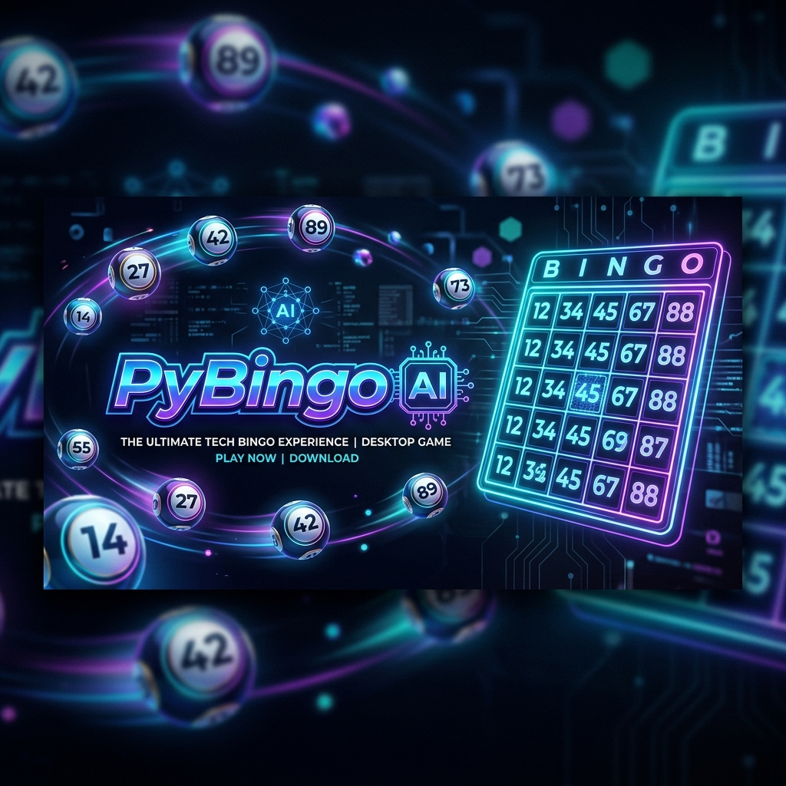
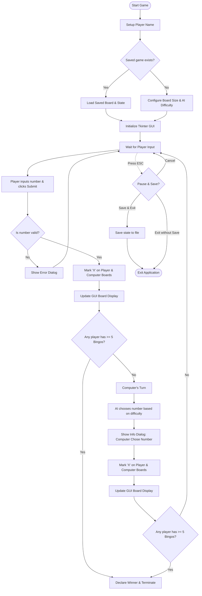

<p align="center">
  
</p>

<h1 align="center">🎮 PyBingo AI</h1>
<p align="center"><strong>An Interactive, Intelligent Desktop Bingo Game Powered by Python & Tkinter</strong></p>

<p align="center">
  
  
  
  
  
</p>

---

## 🌟 Overview

**PyBingo AI** is a premium, lightweight, and highly interactive desktop Bingo game engineered completely in Python 3. Utilizing standard library tools, it couples a streamlined command-line setup process with a clean side-by-side Graphical User Interface (GUI) powered by `tkinter`. 

Featuring customizable grid matrices, dynamic game progression tracking, a robust state saving/resuming mechanism, and a rule-based AI engine with multiple difficulty settings, PyBingo AI offers a polished player-versus-computer gaming experience without requiring any external third-party dependencies.

---

## ✨ Features

*   🖥️ **Dual-Board GUI**: Side-by-side interactive panels for the player's board and the computer's board.
*   🧠 **Smart AI Opponent**: Play against a computer that adapts to your choices. Supports **Easy**, **Medium**, and **Hard** difficulty levels with distinct logic.
*   📐 **Custom Matrix Sizes**: Scale the board from a quick $3\times3$ grid to a standard $5\times5$ grid, or even larger custom matrices.
*   💾 **Persistent State Engine**: Press `ESC` at any time to pause and save. The game auto-detects existing save files based on your profile name to let you resume later.
*   🏆 **B-I-N-G-O Score Tracker**: Visual letter-by-letter scoring indicators representing the player and computer progression toward completing five lines.
*   📦 **Zero Configuration**: Built strictly on top of Python's standard modules (`tkinter` and `random`). Run it instantly on any OS.

---

## 🕹️ Game Lifecycle & Architecture

The application flow transitions from an interactive terminal-based initialization to a fully responsive graphical window. Below is a detailed view of the application lifecycle:



---

## 🤖 AI Difficulty Mechanics

The CPU opponent implements three distinct heuristics to challenge the player:

| Difficulty Level | Decision Rule | Gameplay Strategy |
| :--- | :--- | :--- |
| **Easy** | Random Selection | Picks any remaining number randomly from the valid number pool. |
| **Medium** | Self-Completion Check | Analyzes its own board to find rows, columns, or diagonals with `size - 1` marks, picking the final winning number. Falls back to random selection. |
| **Hard** | Advanced Grid Completion | Analyzes the board layout to maximize line completions, searching for high-probability lines (`size - 1` marked cells). Falls back to random selection. |

---

## 🛠️ Installation & Execution

### 1. Prerequisites
Ensure you have Python 3.x installed. Verify this by running:
```bash
python --version
```

> [!NOTE]
> `tkinter` comes pre-installed with Python on Windows and macOS. For Linux systems, you might need to install it via your package manager:
> *   *Ubuntu/Debian:* `sudo apt-get install python3-tk`
> *   *Fedora/RHEL:* `sudo dnf install python3-tkinter`

### 2. Run the Game
1. Download or clone the project files.
2. Navigate to the project root directory in your terminal.
3. Launch the game:
   ```bash
   python Bingo.py
   ```

---

## 🎮 How to Play

### Step 1: Initial Setup (Terminal Console)
When launching the script, input your name. The game will automatically check for a save file named `<YourName>_save.txt`. If found, it prompts you to resume. If not:
- Input the desired board size (e.g., `5` for a $5\times5$ grid).
- Select the AI difficulty level (`easy`, `medium`, or `hard`).

### Step 2: The Gameplay Window
The GUI window renders two boards:
- **Left Panel**: Your Board (fully visible numbers).
- **Right Panel**: The Computer's Board (shows numbers, with marked cells updating).
- **Action Box**: Enter any unmarked number present on the boards and click **Submit**.
- The number is marked with a red **`X`** on both boards.
- The computer immediately calculates its move and presents it in a pop-up.
- As rows, columns, and diagonals fill, scores update towards spelling "**B I N G O**".
- First to reach 5 completed lines wins!

### Step 3: Saving and Pausing
Press the **`ESC`** key at any point to trigger the pause dialog:
- **Yes**: Saves the current state (grids, difficulty, scores, remaining pool) to `<YourName>_save.txt` and exits.
- **No**: Exits the game immediately without saving progress.
- **Cancel**: Closes the dialog and returns to the game.

---

## 📂 Project Structure

```
Bingo_py/
├── Bingo.py             # Core game engine, AI logic, and Tkinter GUI
├── banner.png           # Graphic banner asset
├── BINGO.pdf            # PDF documentation & traditional game rules
└── README.md            # Interactive markdown documentation
```

---

## 💻 Code Insights

### Dynamic Line Verification
The score is checked after every move. The system counts rows, columns, and diagonals:

```python
def count_bingos(board):
    size = len(board)
    count = 0

    # Verify Rows
    for row in board:
        if all(cell == 'X' for cell in row):
            count += 1

    # Verify Columns
    for col in range(size):
        if all(board[row][col] == 'X' for row in range(size)):
            count += 1

    # Verify Diagonals
    if all(board[i][i] == 'X' for i in range(size)):
        count += 1
    if all(board[i][size - i - 1] == 'X' for i in range(size)):
        count += 1

    return count
```

---

## 📝 License
This project is open-source. Feel free to modify, extend, and share!
